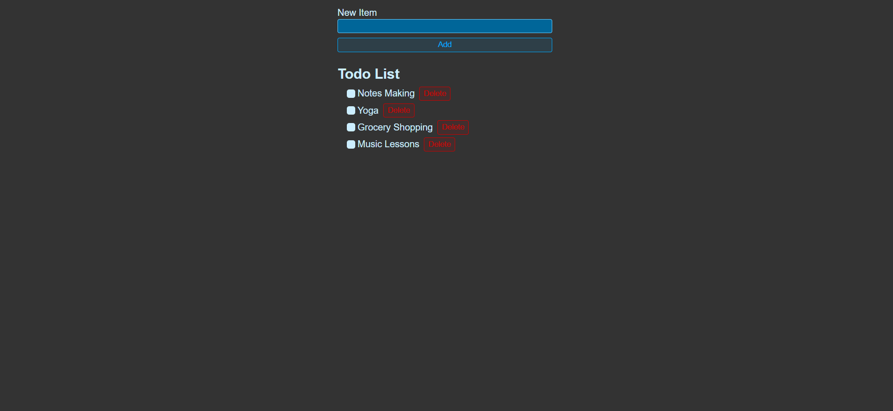

# Todo-List

A Simple and Effective Task Manager

This project is a web-based application that allows you to create and manage your tasks in a todo list. It uses HTML, CSS, and JavaScript to create a user-friendly interface that lets you add, edit, delete, and mark your tasks as complete or incomplete.

Here's a live deployment - https://todo-list-erhn.onrender.com

<center>
    
</center>

## Tech-Stack

- React
- HTML
- CSS

## Features

- The application allows you to create a new task by entering its name.
- The application displays your tasks in a list.
- The application allows you delete any task.
- The application allows you to mark any task as complete or incomplete by clicking on the checkbox next to its name.
- The application saves your tasks in the local storage of your browser, so you can access them anytime.

## Installation and Usage

To install and run this project, you need to have Nodejs installed on your computer.

To download the code for this project, you can clone this GitHub repository using the following command:

```git clone https://github.com/Amritha-07/Todo-List.git```

To start the application

```npm start```

## References

- [Learn React With This One Project](https://www.youtube.com/watch?v=Rh3tobg7hEo) from Web Dev Simplified
